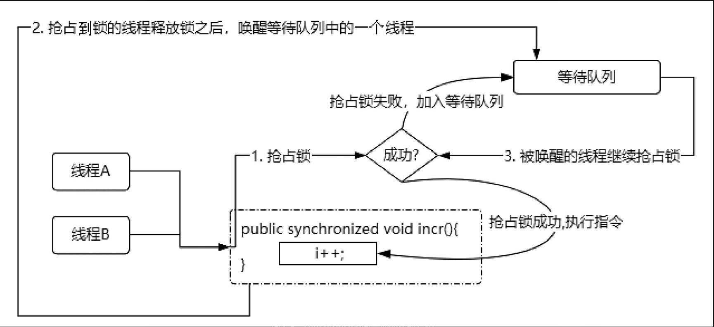
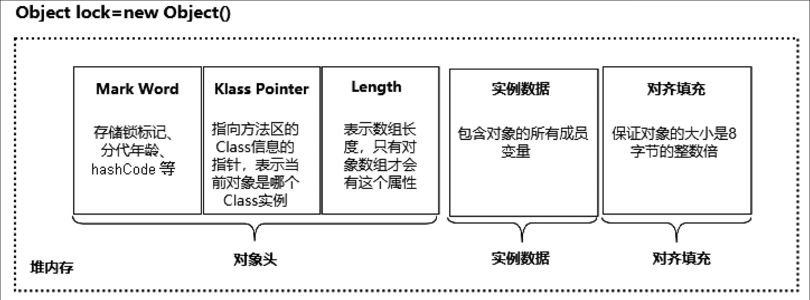

同步锁的本质就是实现多线程的互斥，保证同一时刻只有一个线程能够访问加了同步锁的代码，使得线程安全性得到保证。
下面我们思考一下，为了达到这个目的，我们应该怎么做呢？
1. 同步锁的核心特性是排他，要达到这个目的，多个线程必须去抢占同一个资源。
2. 在同一时刻只能有一个线程执行加了同步锁的代码，意味着同一时刻只允许一个线程抢占到这个共享资源（锁），其余没抢占到的线程只能等待。 
3. 处于等待状态的线程不能一直占用CPU资源，如果没抢占到锁就要被阻塞等待，并且释放CPU资源。
4. • 如果非常多的线程都被阻塞了，那么我们要通过一个容器来存储线程，当获得锁的线程执行完任务并释放锁后，要从这个容器中唤醒一个线程，被唤醒的线程会再次尝试抢占锁。
   
根据这个猜想，可以形成如图2-5所示的流程图，synchronized同步锁实际的实现比这个流程图要复杂，后面我们会详细讲解。大家可以根据这个图来理解synchronized同步锁，在脑海里形成一个初步的全局视角。

## Mark Word的存储结构
一个Java对象被初始化之后会存储在堆内存中，那么这个对象在堆内存中存储了哪些信息呢？Java对象存储结构可以分为三个部分：对象头、实例数据、对齐填充。当我们构建一个Object lock=new Object()对象实例时，这个lock实例最终的存储结构就对应如图2-6所示的模型。

图2-6　对象在内存中的布局模型

