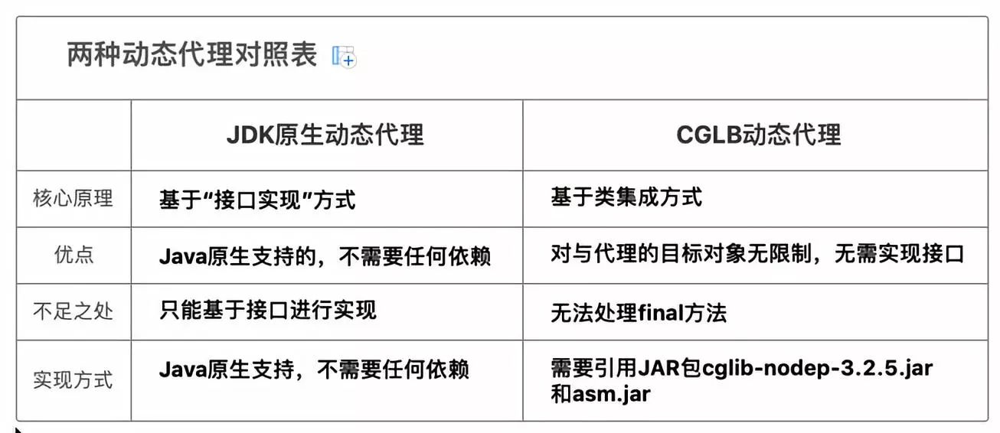

## JDK原生动态代理

1. Proxy：Proxy是所有动态代理的父类；它提供了一个静态的方法创建代理的Class对象来配置生成代理类Class文件的方法与参数，主要就是通过Proxy.newProxyInstance(类加载器，类实现的接口，InvocationHandler实现类)，返回Object类型，通过接口类型强转换即可使用代理类；
   
2. InvacationHandler：每个动态代理实例都有一个关联的InvocationHandler；被代理类的代理方法被调用时，方法将被转发到InvocationalHandler的invoke方法执行，增强的部分此处定义。

小结：被代理类必须是某个接口的实现类

## CGLB
CGLB全称是Code Generation Library，是一个基于ASM的字节码生成库，允许我们在运行时对字节码文件进行修改和动态生成。

重要组成
1. Enchancer：来指定要代理的目标对象；实际处理逻辑的对象；最终通过create()方法得到代理对象，对这个对象的非final()方法的调用都会转发给代理对象； 
2. MethodInterceptor：动态代理的方法调用都会转发到intercept()上进行增强；

小结：CGLB动态代理实现方式降低了被代理对象的要求,但CGLB动态代理对于被代理对象的final方法无法进行增强

##应用
Spring 中的动态代理，具体用哪种，分情况：

如果代理对象有接口，就用 JDK 动态代理，否则就是 Cglib 动态代理。

如果代理对象没有接口，那么就直接是 Cglib 动态代理。
#面试题
## JDK动态代理与CGLB的区别？
1. JDK 动态代理只能代理实现了接口的类或者直接代理接口，而 CGLIB 可以代理未实现任何接口的类。 另外， CGLIB 动态代理是通过生成一个被代理类的子类来拦截被代理类的方法调用，因此不能代理声明为 final 类型的类和方法。
2. 就二者的效率来说，大部分情况都是 JDK 动态代理更优秀，随着 JDK 版本的升级，这个优势更加明显

