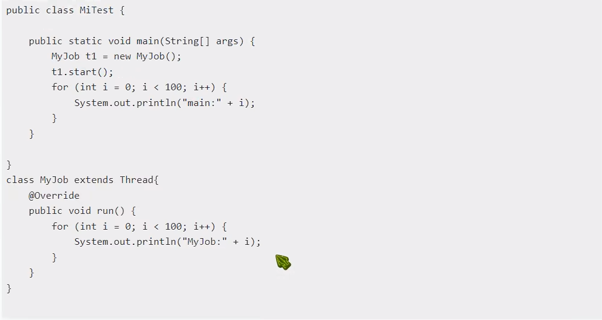
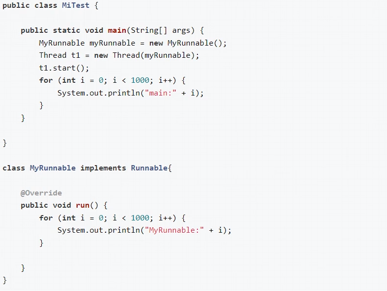
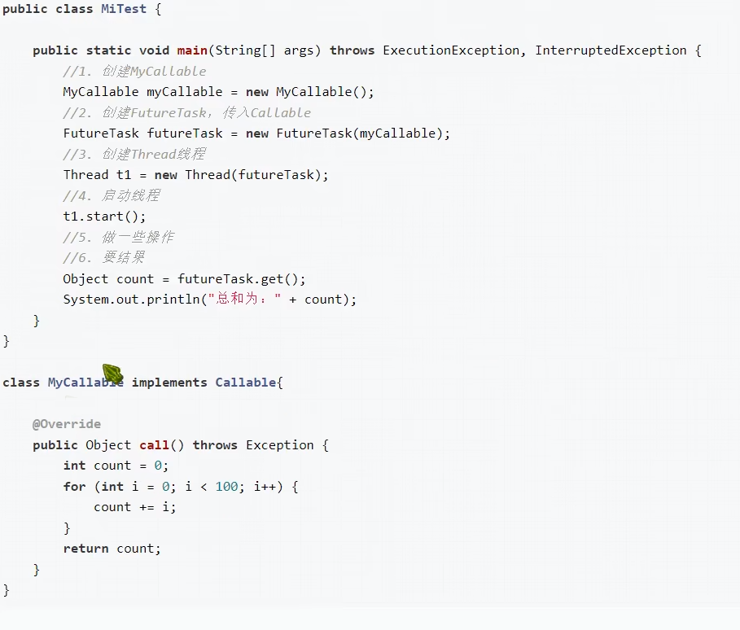
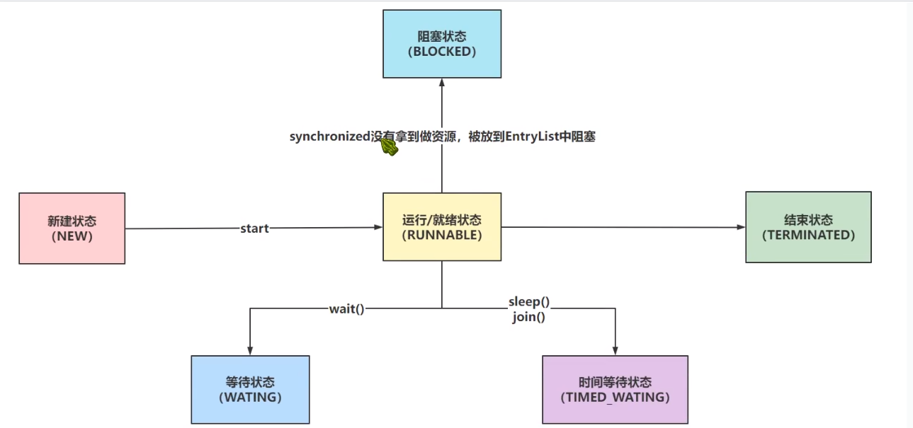
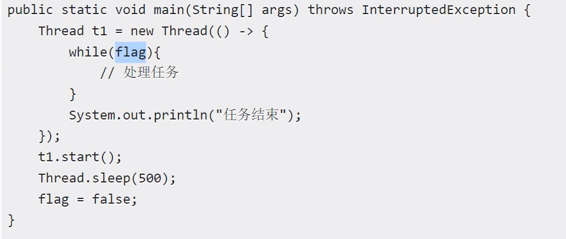

#面试
##java中线程实现的方式？
1. 继承Thread类，重写run方法
   
2. 实现Runable接口，重写run方法
   
3.如果想要拿到线程执行的返回结果，实现callable接口,重写call方法，配合FutureTask
   
4.基于线程池
底层都是实现Runnable实现的

##java中线程的状态
1. 新建
2. 就绪
3. 运行
4. 阻塞 没有拿到锁，被放到等待队列 
6. 等待 持有锁之后因wait(),sleep(),join等方法导致等待
5. 结束

   
##java中如何停止线程
1. stop 任务没结束，强制线程执行结束，已过时
2. 使用共享变量，通过判断共享变量的状态，结束线程

3. interrupt方式，interrupt是线程内部的表示线程是否中断的状态，通过执行interrupt方法改变线程状态，并提供了isinterrupt()方法
获取线程状态，从而达到控制线程的中断的目的，是使用共享变量的改进.
## sleep()与wait()的区别
1. sleep()是Thread类的static方法，wait()属于Object类的方法
2. sleep()属于TIMED_WAITING的等待，到达设置的时间会自动唤醒，继续执行任务；wait属于WAITING，需要手动唤醒；
3. sleep()在持有锁时执行不会释放锁，wait在执行后，会释放锁资源
4. sleep()可以在持有锁或者不持有锁时执行，wait()方法必须在只有持有锁时才能执行。？
